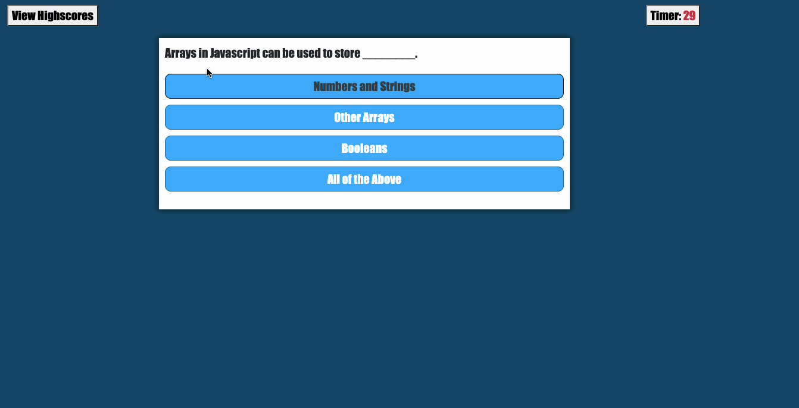

# Code Quiz

## Description

This is a simple code quiz application. For every wrong answer, 10 seconds is deducted from your timer and final score. High score wins!

## User Story

    AS A student
    I WANT to test my coding knowledge
    SO THAT I can see my strength and weaknesses

## Criteria

    GIVEN two buns for the burger

    WHEN the user click on Start Quiz
    THEN the timer begins and the first question is shown
    WHEN the user selects a wrong answer
    THEN 10 seconds will be removed from the timer
    WHEN the user completes the quiz
    THEN the user is prompted with inputing their initials for the scoreboard
    WHEN the user clicks on View Highscores
    THEN the user will be able to see their high score as well as past high scores

## Link

The link below will give you access to the web application:

https://dghazi12.github.io/davidaghazi04.github.io/

## Preview

